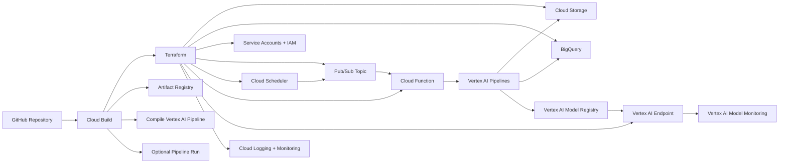

# mlops-gcp-architecture

Proyecto academico de Cloud Computing/MLOps en Google Cloud Platform para automatizar el ciclo de vida de modelos de machine learning con una arquitectura reusable, reproducible y model-agnostic.

El objetivo no es crear el mejor modelo posible, sino construir una plataforma MLOps que permita reemplazar facilmente el dataset, el entrenamiento, las metricas, las reglas de despliegue y el endpoint de prediccion.

## Arquitectura general



## Por que es model-agnostic

El repositorio separa la plataforma MLOps del modelo. El pipeline tiene componentes reemplazables:

- `pipeline/components/data_validation.py`
- `pipeline/components/preprocessing.py`
- `pipeline/components/train.py`
- `pipeline/components/evaluate.py`
- `pipeline/components/deploy.py`

La primera version usa un clasificador simple de `scikit-learn` con datos sinteticos. Ese modelo solo valida que el flujo end-to-end funciona. Mas adelante se puede sustituir por TensorFlow, PyTorch, XGBoost, computer vision, NLP, regresion, clasificacion u otro caso de uso.

## Herramientas usadas

- Google Cloud Platform
- Terraform
- Vertex AI
- Vertex AI Pipelines / Kubeflow Pipelines
- Google Cloud Pipeline Components
- Cloud Build
- Cloud Storage
- BigQuery
- Artifact Registry
- Cloud Functions
- Pub/Sub
- Cloud Scheduler
- Vertex AI Model Registry
- Vertex AI Endpoint
- Vertex AI Model Monitoring
- Cloud Logging / Cloud Monitoring

## Estructura

```text
mlops-gcp-architecture/
├── README.md
├── cloudbuild.yaml
├── Dockerfile
├── requirements.txt
├── infra/
├── data/
├── pipeline/
├── src/
├── functions/
├── docs/
└── diagrams/
```

## Desplegar infraestructura

```bash
cd infra
terraform init
terraform validate
terraform plan \
  -var="project_id=YOUR_PROJECT_ID" \
  -var="bucket_name=YOUR_UNIQUE_BUCKET_NAME"
terraform apply \
  -var="project_id=YOUR_PROJECT_ID" \
  -var="bucket_name=YOUR_UNIQUE_BUCKET_NAME"
```

## Generar datos sinteticos

```bash
python data/generate_synthetic_data.py \
  --output data/synthetic_classification.csv \
  --rows 1000
```

Opcionalmente cargar a BigQuery:

```bash
python data/generate_synthetic_data.py \
  --output data/synthetic_classification.csv \
  --rows 1000 \
  --project-id YOUR_PROJECT_ID \
  --bq-table YOUR_PROJECT_ID.mlops_dataset.synthetic_training_data
```

## Compilar pipeline

```bash
python pipeline/compile_pipeline.py \
  --output pipeline/compiled/mlops_pipeline.json
```

Subir el template a Cloud Storage:

```bash
gcloud storage cp pipeline/compiled/mlops_pipeline.json \
  gs://YOUR_BUCKET/pipeline_templates/mlops_pipeline.json
```

## Ejecutar pipeline

```bash
python pipeline/compile_pipeline.py --output pipeline/compiled/mlops_pipeline.json

gcloud ai pipeline-jobs submit \
  --region=us-central1 \
  --display-name=mlops-generic-run \
  --pipeline-file=pipeline/compiled/mlops_pipeline.json \
  --parameter-values=project_id=YOUR_PROJECT_ID,region=us-central1,bq_source_table=YOUR_PROJECT_ID.mlops_dataset.synthetic_training_data,pipeline_root=gs://YOUR_BUCKET/pipeline_root,endpoint_resource_name=projects/YOUR_PROJECT_ID/locations/us-central1/endpoints/1000000001,serving_container_image_uri=us-central1-docker.pkg.dev/YOUR_PROJECT_ID/mlops-containers/mlops-serving:latest
```

## Trigger de reentrenamiento

Cloud Scheduler publica semanalmente en Pub/Sub. Pub/Sub activa una Cloud Function que lanza un `PipelineJob` en Vertex AI usando el template compilado en Cloud Storage.

Tambien se puede disparar manualmente:

```bash
gcloud pubsub topics publish mlops-pipeline-trigger \
  --message='{"reason":"manual-retraining"}'
```

## Cloud Build

`cloudbuild.yaml` ejecuta:

1. `terraform init`
2. `terraform validate`
3. `terraform plan`
4. `terraform apply` opcional
5. instalacion de dependencias Python
6. compilacion del pipeline
7. build de imagen Docker
8. push a Artifact Registry
9. ejecucion opcional del pipeline

Variables utiles:

```bash
gcloud builds submit \
  --config cloudbuild.yaml \
  --substitutions=_REGION=us-central1,_BUCKET_NAME=YOUR_BUCKET,_APPLY_TERRAFORM=false,_RUN_PIPELINE=false
```

## Monitoreo

La arquitectura contempla:

- Vertex AI Model Monitoring para drift y degradacion.
- Cloud Logging para ejecuciones de pipeline, funcion y endpoint.
- Cloud Monitoring para alertas operativas.
- Reportes de validacion/evaluacion guardados como artefactos del pipeline.
- Politica de rollback documentada en `docs/monitoring_strategy.md`.

## Destruir recursos

```bash
cd infra
terraform destroy \
  -var="project_id=YOUR_PROJECT_ID" \
  -var="bucket_name=YOUR_UNIQUE_BUCKET_NAME"
```

Revisar antes los objetos en Cloud Storage y modelos/endpoints activos para evitar costos inesperados.

