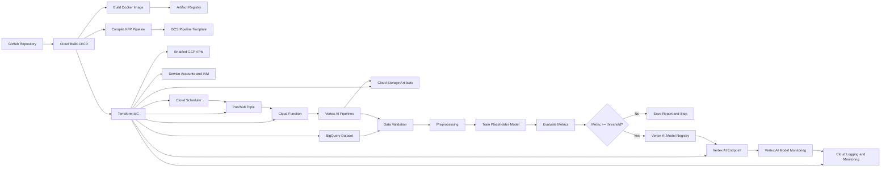

# Architecture

## Mermaid diagram

## GCP services

Cloud Build runs the CI/CD workflow. It validates Terraform, optionally applies infrastructure, builds the serving image, pushes it to Artifact Registry, compiles the Vertex AI Pipeline, uploads the template to Cloud Storage, and can optionally submit a pipeline run.

Terraform creates the reusable platform: service accounts, IAM bindings, Cloud Storage, BigQuery, Artifact Registry, Pub/Sub, Cloud Scheduler, Cloud Function, Vertex AI Endpoint, and basic monitoring resources.

Cloud Storage stores the pipeline root, component artifacts, compiled pipeline template, model artifacts, validation reports, and evaluation reports.

BigQuery stores the example synthetic training table and can later store production datasets, feature views, monitoring exports, and model metrics.

Artifact Registry stores Docker images for training and serving. The current image serves the sklearn placeholder model, but the same repository can host TensorFlow, PyTorch, XGBoost, CV, NLP, or custom prediction containers.

Vertex AI Pipelines orchestrates the ML workflow with Kubeflow Pipelines and Google Cloud Pipeline Components.

Vertex AI Model Registry stores approved model versions. The demo uploads a model only when the configured metric passes the threshold.

Vertex AI Endpoint serves the approved model. Terraform creates the endpoint once, and the pipeline deploys new approved model versions to it.

Cloud Scheduler, Pub/Sub, and Cloud Function automate periodic retraining. Scheduler publishes a message, Pub/Sub delivers it, and the function launches a Vertex AI Pipeline job.

Cloud Logging and Cloud Monitoring centralize operational logs and alerts. Vertex AI Model Monitoring should be configured for production drift and skew monitoring after a model and serving schema are known.

## Data flow

1. Synthetic data is generated locally and loaded to BigQuery.
2. The pipeline reads the source table from BigQuery.
3. Data validation checks row count, expected label column, numeric features, and missing values.
4. Preprocessing creates train/test artifacts in Cloud Storage.
5. Training creates a placeholder sklearn model artifact.
6. Evaluation calculates a generic metric such as accuracy or roc_auc.
7. If the metric is below threshold, the pipeline stops before deployment and saves the report.
8. If the metric passes, the model is uploaded to Vertex AI Model Registry.
9. The model is deployed to the Terraform-created Vertex AI Endpoint.
10. Logs, reports, artifacts, and endpoint activity become monitoring inputs.

## CI/CD flow

1. Code is pushed to GitHub.
2. Cloud Build validates Terraform.
3. Cloud Build optionally applies Terraform.
4. Cloud Build builds and pushes the serving container.
5. Cloud Build compiles the KFP pipeline template.
6. Cloud Build uploads the template to Cloud Storage.
7. Cloud Build optionally runs the pipeline.

## MLOps lifecycle

The architecture supports the complete lifecycle:

- Data ingestion
- Data validation
- Preprocessing
- Training
- Evaluation
- Conditional deployment
- Model registry
- Endpoint deployment
- Monitoring
- Retraining
- Rollback

The model-specific parts are intentionally isolated in component files so that the platform remains useful before the final ML use case is chosen.

